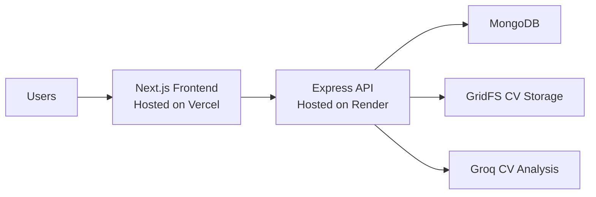

<p align="center">
  
</p>

<h1 align="center">JobPilot</h1>

<p align="center">
  Smart job discovery and hiring management for job seekers, employers, and admins.
</p>

<p align="center">
  
  
  
  
  
  
</p>

## Overview

JobPilot is a full-stack job portal that helps:

- job seekers build profiles, upload CVs, get skill-based job recommendations, and track applications
- employers publish jobs, review applicants, download CVs, and manage hiring progress
- admins monitor users, jobs, and applications from a central dashboard

The platform uses a Next.js frontend, an Express API, MongoDB for application data, GridFS for CV storage, and Groq-powered CV skill extraction for smarter recommendations and applications.

## Live deployment

Replace the example links below with your real production URLs before publishing the repository.

| Surface | Platform | Example URL |
| --- | --- | --- |
| Frontend | Vercel | https://smart-job-portal-jobpilot.vercel.app/ |
| Backend API | Render | https://smart-job-portal-jobpilot.onrender.com/api |
| Health check | Render | https://smart-job-portal-jobpilot.onrender.com/api/health |

## Highlights

- Role-based experience for `jobseeker`, `employer`, and `admin`
- JWT authentication with protected API routes
- Skill-based job recommendations from saved profile data
- CV upload support for PDF and DOCX files
- Automatic skill extraction from CVs using Groq
- Secure CV download access for authorized users
- Admin dashboard for user, job, and application management

## Architecture



## Feature breakdown

### Job seekers

- Register and log in securely
- Build and update a profile with skills, education, and experience
- Upload a CV and analyze it for skill extraction
- Browse jobs by keyword, location, category, and job type
- Receive recommended jobs based on saved skills
- Apply with a cover letter and CV
- Track submitted applications and hiring status

### Employers

- Create, edit, and delete job listings
- View their own posted jobs
- Review applicants per job
- View candidate profiles
- Download applicant CVs
- Update application status to `Pending`, `Reviewed`, `Shortlisted`, `Rejected`, or `Accepted`

### Admins

- Access platform statistics from the admin dashboard
- View all users
- Activate or deactivate user accounts
- Delete users
- View all jobs
- Remove jobs when necessary
- Inspect all submitted applications

## Tech stack

| Layer | Tools |
| --- | --- |
| Frontend | Next.js 16, React 19, TypeScript, Tailwind CSS 4 |
| Backend | Node.js, Express 5, Mongoose, JWT |
| Database | MongoDB |
| File storage | MongoDB GridFS |
| Document parsing | `pdf-parse`, `mammoth` |
| AI integration | Groq with `llama-3.3-70b-versatile` |

## API surface

| Route group | Purpose |
| --- | --- |
| `/api/auth` | Register, log in, and fetch the current user |
| `/api/jobs` | Browse jobs, manage employer jobs, and fetch recommendations |
| `/api/applications` | Apply to jobs, list applications, download CVs, and update statuses |
| `/api/profile` | Manage job seeker profiles and analyze CVs |
| `/api/admin` | Admin dashboard, users, jobs, and applications |

## Production environment variables

### Render backend

Set these in your Render service for the `backend` app:

```env
MONGO_URI=your_mongodb_connection_string
JWT_SECRET=your_jwt_secret
GROQ_API_KEY=your_groq_api_key
CLIENT_URL=https://smart-job-portal-jobpilot.vercel.app/
```

Notes:

- `CLIENT_URL` must match your Vercel frontend URL for CORS to work
- `PORT` is already handled by `process.env.PORT || 5000`

### Vercel frontend

Set this in your Vercel project for the `frontend` app:

```env
NEXT_PUBLIC_API_URL=https://smart-job-portal-jobpilot.onrender.com/api
```

Notes:

- `NEXT_PUBLIC_API_URL` must point to the deployed Render backend
- after changing environment variables, redeploy the frontend if needed

## Local development

### 1. Install dependencies

```bash
cd backend
npm install
```

```bash
cd frontend
npm install
```

### 2. Create local environment files

`backend/.env`

```env
PORT=5000
MONGO_URI=your_mongodb_connection_string
JWT_SECRET=your_jwt_secret
CLIENT_URL=http://localhost:3000
GROQ_API_KEY=your_groq_api_key
```

`frontend/.env.local`

```env
NEXT_PUBLIC_API_URL=http://localhost:5000/api
```

### 3. Start the backend

```bash
cd backend
npm run dev
```

Backend default URL: `http://localhost:5000`

### 4. Start the frontend

```bash
cd frontend
npm run dev
```

Frontend default URL: `http://localhost:3000`

## Deployment guide

### Deploy backend to Render

Use these settings for the backend service:

- Root directory: `backend`
- Build command: `npm install`
- Start command: `npm start`
- Environment variables: `MONGO_URI`, `JWT_SECRET`, `GROQ_API_KEY`, `CLIENT_URL`

After deployment, confirm the API is working by opening:

- `/`
- `/api/health`

### Deploy frontend to Vercel

Use these settings for the frontend project:

- Root directory: `frontend`
- Framework preset: `Next.js`
- Environment variable: `NEXT_PUBLIC_API_URL`

Make sure `NEXT_PUBLIC_API_URL` points to your Render backend, including `/api`.

## Project structure

```text
smart-job-portal/
|-- backend/
|   |-- config/
|   |-- controllers/
|   |-- middleware/
|   |-- models/
|   |-- routes/
|   |-- services/
|   `-- server.js
|-- frontend/
|   |-- app/
|   |-- components/
|   |-- hooks/
|   |-- lib/
|   `-- public/
`-- README.md
```

## Available scripts

### Backend

- `npm run dev` starts the Express server with `nodemon`
- `npm start` starts the Express server in production mode

### Frontend

- `npm run dev` starts the Next.js development server
- `npm run build` builds the production app
- `npm run start` runs the production build
- `npm run lint` runs ESLint

## Main user flows

### Job seeker flow

1. Register or log in
2. Complete the profile
3. Upload a CV and analyze it for skills
4. Browse or filter jobs
5. View recommended jobs
6. Apply with a cover letter and CV
7. Track application progress

### Employer flow

1. Register as an employer
2. Post and manage jobs
3. Review applicants
4. View extracted skill data
5. Download CVs and update statuses

### Admin flow

1. Open the admin dashboard
2. Review users, jobs, and applications
3. Moderate platform activity when required

## Notes

- CV uploads support PDF and DOCX only
- maximum CV size is 2 MB
- CV files are stored in MongoDB GridFS
- recommendation matching is based on overlap between profile skills and job skills

## Future improvements

- Add automated frontend and backend tests
- Add pagination for large job and application lists
- Add email notifications for status changes
- Improve recommendation scoring beyond exact skill overlap
- Add a public demo video or screenshots section
